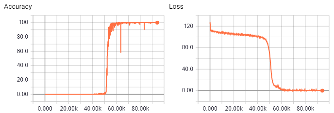

# Pre-trained Differentiable Neural Computer for the Copy Problem

This is a fork of DeepMind's DNC, with parameters changed to match those described in
the caption of Extended Data Figure 4 in the paper [1], used to demonstrate the DNC's
ability to learn a copy algorithm that generalises to long sequences. The model has been
trained until generalization, with checkpoints and TensorBoard summaries stored in the 
`checkpoints` and `output` directories respectively. A batch size of 50 was used instead of 100
as in the paper to reduce the training time, however the same result was reproduced as shown below.

For more information, see the [original repository](https://github.com/deepmind/dnc) and [paper](https://www.nature.com/articles/nature20101.epdf?author_access_token=ImTXBI8aWbYxYQ51Plys8NRgN0jAjWel9jnR3ZoTv0MggmpDmwljGswxVdeocYSurJ3hxupzWuRNeGvvXnoO8o4jTJcnAyhGuZzXJ1GEaD-Z7E6X_a9R-xqJ9TfJWBqz) [1].

This fork depends on [tensorboardX](https://github.com/lanpa/tensorboardX) for writing summaries.

## Results

Extended Data Figure 4 in the paper [1] quantifies the correctness of the network output using the
fraction of sequences out of a batch of 100 copied without mistakes. As we can see from the graphs below,
this fork successfully replicated the results published in the paper. According to the paper, the abrupt
increase in accuracy occurs when the network suddenly learns a copy algorithm that generalizes to longer
sequences.

## References

[1] [“Hybrid computing using a neural network with dynamic external memory",
Nature 538, 471–476 (October 2016) doi:10.1038/nature20101](
https://www.nature.com/articles/nature20101.epdf?author_access_token=ImTXBI8aWbYxYQ51Plys8NRgN0jAjWel9jnR3ZoTv0MggmpDmwljGswxVdeocYSurJ3hxupzWuRNeGvvXnoO8o4jTJcnAyhGuZzXJ1GEaD-Z7E6X_a9R-xqJ9TfJWBqz
)
